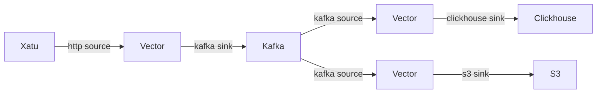

# analytics-pipeline

The repo contains some of the info/config/migrations for our analytics pipeline.

We currently extract data via [xatu](https://github.com/ethpandaops/xatu) and load into clickhouse. We use kafka and vector for the pipeline and also store raw data into s3 for a small period of time.

## Layout

- [`vector/http`](./vector/http) - Vector config for xatu -> kafka
- [`vector/clickhouse`](./vector/kclickhousefka) - Vector config for kafka -> clickhouse
- [`vector/s3`](./vector/s3) - Vector config for kafka -> s3
- [`clickhouse`](./clickhouse) - Clickhouse migrations
- [`kafka`](./kafka) - Kafka config

## Kafka

We use [strimzi-kafka-operator](https://github.com/strimzi/strimzi-kafka-operator) for the kafka cluster.

## Clickhouse

We us Altinity [clickhouse-operator](https://github.com/Altinity/clickhouse-operator) for the clickhouse cluster and [golange-migrate](https://github.com/golang-migrate/migrate) for migrations. The cluster is distributed with 3 shards and 2 replicas per shard.
