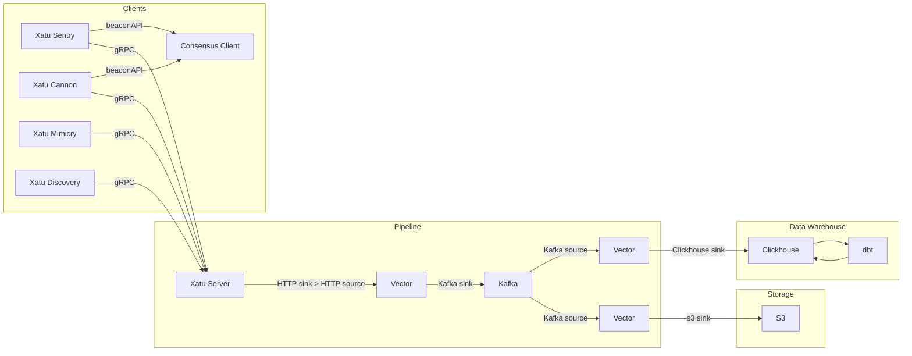

# analytics-pipeline

The repo contains some of the info/config/migrations for our analytics pipeline.

We currently extract data via [xatu](https://github.com/ethpandaops/xatu) and load into clickhouse. We use Kafka and vector for the pipeline and also store raw data into s3 for a small period of time.



We use [kubernetes](https://kubernetes.io/) for orchestration and [helm](https://helm.sh/) for deployment. Setup of kubernetes, helm and other tools is out of scope for this repo.

## Directory layout

- [`vector/http`](./vector/http) - Vector config for Xatu server -> Kafka
- [`vector/clickhouse`](./vector/kclickhousefka) - Vector config for Kafka -> clickhouse
- [`vector/s3`](./vector/s3) - Vector config for Kafka -> s3
- [`clickhouse/migrations`](./clickhouse/migrations) - Clickhouse migrations
- [`clickhouse/helm/clickhouse`](./clickhouse/helm/clickhouse/) - Clickhouse helm chart
- [`clickhouse/helm/zookeeper`](./clickhouse/helm/zookeeper/) - Zookeeper helm chart
- [`kafka`](./kafka) - Kafka config
- [`xatu/helm/server`](./xatu/server) - Xatu server helm chart
- [`xatu/helm/sentry`](./xatu/sentry) - Xatu sentry helm chart
- [`xatu/helm/mimicry`](./xatu/mimicry) - Xatu mimicry helm chart
- [`xatu/helm/cannon`](./xatu/cannon) - Xatu cannon helm chart
- [`xatu/helm/discovery`](./xatu/discovery) - Xatu discovery helm chart

## Kafka

We use [strimzi-kafka-operator](https://github.com/strimzi/strimzi-kafka-operator) for the kafka cluster.

## Clickhouse

We us Altinity [clickhouse-operator](https://github.com/Altinity/clickhouse-operator) for the clickhouse cluster and [golang-migrate](https://github.com/golang-migrate/migrate) for migrations. The cluster is distributed with 3 shards and 2 replicas per shard.

Example [golange-migrate](https://github.com/golang-migrate/migrate) command to run migrations:
```bash
# ! replace username/password/database with your own
migrate -database "clickhouse://127.0.0.1:9000?username=admin&password=XYZ&database=default&x-multi-statement=true&x-cluster-name='{cluster}'&x-migrations-table-engine=ReplicatedMergeTree" -path ./clickhouse/migrations up
```

## Xatu sentries

We use [ethereum-node](https://github.com/ethpandaops/ethereum-helm-charts/tree/master/charts/ethereum-node) helm chart to deploy xatu sentries along side CL nodes.

For the execution layer we typically deploy one execution layer client (nethermind) per region, then use [eleel](https://github.com/sigp/eleel) to allow us to have multiple consensus layer clients for one execution layer client as a cost saving measure.
